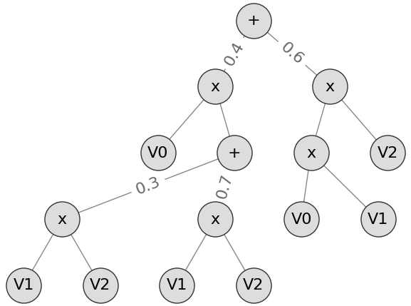
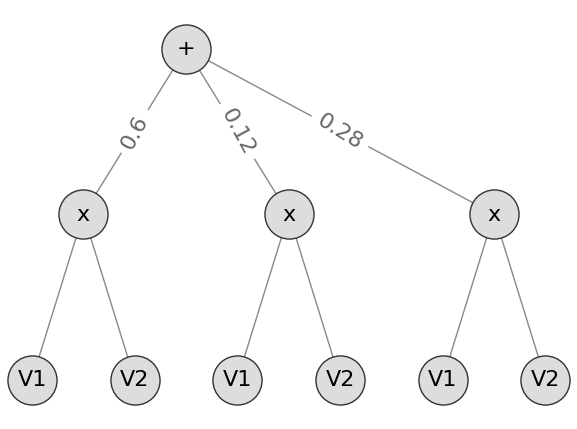
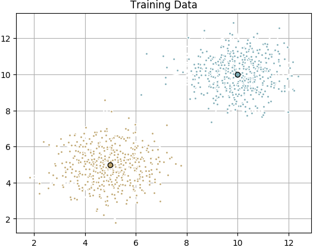

# SPFlow: An Easy and Extensible Library for Sum-Product Networks

SPFlow, an open-source Python library providing a simple interface to inference,
learning  and  manipulation  routines  for  deep  and  tractable  probabilistic  models called Sum-Product Networks (SPNs).
The library allows one to quickly create SPNs both from data and through a domain specific language (DSL).
It efficiently implements several probabilistic inference routines like computing marginals, conditionals and (approximate) most probable explanations (MPEs)
along with sampling as well as utilities for serializing,plotting and structure statistics on an SPN.

Furthermore, SPFlow is extremely extensible and customizable, allowing users to  promptly  create  new  inference  and  learning  routines
by  injecting  custom  code  into  a light-weight functional-oriented API framework.

## Getting Started

These instructions will get you a copy of the project up and running on your local machine for development and testing purposes.

### Prerequisites

The following modules must be installed:

```sh
$ pip3 install cppyy
$ pip3 install joblib
$ pip3 install matplotlib
$ pip3 install natsort
$ pip3 install networkx
$ pip3 install numba
$ pip3 install numpy
$ pip3 install pydot
$ pip3 install scipy
$ pip3 install sklearn
$ pip3 install statsmodels
$ pip3 install tqdm
$ pip3 install py-cpuinfo
$ pip3 install lark-parser
$ pip3 install tensorflow
```

### Installing

To install SPFlow, all you have to do is clone the repository.

```sh
mkdir SPFlow
git clone https://github.com/alejandromolinaml/SPFlow
```

## Examples

We start by creating an SPN. Using a Domain-Specific Language (DSL), we can quickly create an SPN of categorical
leave nodes like this:


```python
from spn.structure.leaves.parametric.Parametric import Categorical

spn = 0.4 * (Categorical(p=[0.2, 0.8], scope=0) * 
             (0.3 * (Categorical(p=[0.3, 0.7], scope=1) * 
                     Categorical(p=[0.4, 0.6], scope=2)) 
            + 0.7 * (Categorical(p=[0.5, 0.5], scope=1) * 
                     Categorical(p=[0.6, 0.4], scope=2)))) 
    + 0.6 * (Categorical(p=[0.2, 0.8], scope=0) * 
             Categorical(p=[0.3, 0.7], scope=1) * 
             Categorical(p=[0.4, 0.6], scope=2))
```

The p parameter indicates the probabilities, and the scope indicates the variable we are modeling.


We can now visualize the SPN using:

```python
from spn.io.Graphics import plot_spn

plot_spn(spn, 'basicspn.png')
```



Marginalizing an SPN means summing out all the other non-relevant variables.
So, if we want to marginalize the above SPN and sum out all other variables leaving only variables 1 and 2, we can do:

```python
from spn.algorithms.Marginalization import marginalize

spn_marg = marginalize(spn, [1,2])
```
Here, we marginalize all the variables not in [1,2], and create a *NEW* structure that knows nothing about the previous one
nor about the variable 0.

We can use this new spn to do all the operations we are interested in. That means, we can also plot it!
```python
plot_spn(spn_marg, 'marginalspn.png')
```


We can also dump the SPN as text:
```python
from spn.io.Text import spn_to_str_equation
txt = spn_to_str_equation(spn_marg)
print(txt)
```
And the output is:
```python
(0.6*((Categorical(V1|p=[0.3, 0.7]) * Categorical(V2|p=[0.4, 0.6]))) + 0.12000000000000002*((Categorical(V1|p=[0.3, 0.7]) * Categorical(V2|p=[0.4, 0.6]))) + 0.27999999999999997*((Categorical(V1|p=[0.5, 0.5]) * Categorical(V2|p=[0.6, 0.4]))))
```

However, the most interesting aspect of SPNs is the tractable inference. Here is an example on how to evaluate the SPNs from above.
Since we have 3 variables, we want to create a 2D numpy array of 3 columns and 1 row.
```python
import numpy as np
test_data = np.array([1.0, 0.0, 1.0]).reshape(-1, 3)
```

We then compute the log-likelihood:
```python
from spn.algorithms.Inference import log_likelihood

ll = log_likelihood(spn, test_data)
print(ll, np.exp(ll))
```

And the output is:
```python
[[-1.90730501]] [[0.14848]]
```

We can also compute the log-likelihood of the marginal SPN:
```python
llm = log_likelihood(spn_marg, test_data)
print(llm, np.exp(llm))
```
Note that we used the same test_data input, as the SPN is still expecting a numpy array with data at columns 1 and 2, ignoring column 0.
The output is:
```python
[[-1.68416146]] [[0.1856]]
```

Another alternative, is marginal inference on the original SPN. This is done by setting as np.nan the feature we want to marginalize on the fly.
It does not change the structure.

```python
test_data2 = np.array([np.nan, 0.0, 1.0]).reshape(-1, 3)
llom =  log_likelihood(spn, test_data2)
print(llom, np.exp(llom))
```

The output is exactly the same as the evaluation of the marginal spn:
```python
[[-1.68416146]] [[0.1856]]
```

We can use tensorflow to do the evaluation in a GPU:
```python
from spn.gpu.TensorFlow import eval_tf
lltf = eval_tf(spn, test_data)
print(lltf, np.exp(lltf))
```
The output is as expected, equal to the one in python:
```python
[[-1.90730501]] [[0.14848]]
```

We can also use tensorflow to do the parameter optimization in a GPU:
```python
from spn.gpu.TensorFlow import optimize_tf
optimized_spn = optimize_tf(spn, test_data)
lloptimized = log_likelihood(optimized_spn, test_data)
print(lloptimized, np.exp(lloptimized))
```
The output is of course, higher likelihoods:
```python
[[-1.38152628]] [[0.25119487]]
```

We can generate new samples that follow the joint distribution captured by the SPN!
```python
from numpy.random.mtrand import RandomState
from spn.algorithms.Sampling import sample_instances
print(sample_instances(spn, np.array([np.nan, np.nan, np.nan] * 5).reshape(-1, 3), RandomState(123)))
```
Here we created 5 new instances that follow the distribution
```python
[[0. 1. 0.]
 [1. 0. 0.]
 [1. 1. 0.]
 [1. 1. 1.]
 [1. 1. 0.]]
```
the np.nan values indicate the columns we want to sample.

We can also do conditional sampling, that is, if we have evidence for some of the variables we can pass that information
to the SPN and sample for the rest of the variables:
```python
from numpy.random.mtrand import RandomState
from spn.algorithms.Sampling import sample_instances
print(sample_instances(spn, np.array([np.nan, 0, 0] * 5).reshape(-1, 3), RandomState(123)))
```
Here we created 5 new instances whose evidence is V1=0 and V2=0
```python
[[0. 0. 0.]
 [1. 0. 0.]
 [0. 0. 0.]
 [1. 0. 0.]
 [1. 0. 0.]]
```

We can do classification, by learning an SPN from data and then comparing the probabilities for the given classes:
Imagine we have the following dataset:



generated by two gaussians with means (5,5) and (10,10), and we label the cluster at (5,5) to be class 0 and the cluster at (10,10) to be class 1.

```python
np.random.seed(123)
train_data = np.c_[np.r_[np.random.normal(5, 1, (500, 2)), np.random.normal(10, 1, (500, 2))],
                   np.r_[np.zeros((500, 1)), np.ones((500, 1))]]
```

We can learn an SPN from data:

```python
from spn.algorithms.LearningWrappers import learn_parametric, learn_classifier
from spn.structure.leaves.parametric.Parametric import Categorical, Gaussian
from spn.structure.Base import Context
spn_classification = learn_classifier(train_data,
                       Context(parametric_types=[Gaussian, Gaussian, Categorical]).add_domains(train_data),
                       learn_parametric, 2)
```
Here, we model our problem as containing 3 features, two Gaussians for the coordinates and one Categorical for the label.
We specify that the label is in column 2, and create the corresponding SPN.

Now, imagine we want to classify two instances, one located at (3,4) and another one at (12,8).
To do that, we first create an array with two rows and 3 columns. We set the last column to np.nan to indicate that we don't know the labels.
And we set the rest of the values in the 2D array accordingly.

```python
test_classification = np.array([3.0, 4.0, np.nan, 12.0, 18.0, np.nan]).reshape(-1, 3)
```
the first row is the first instance, the second row is the second instance.
```python
[[ 3.  4. nan]
 [12. 18. nan]]
```

We can do classification via approximate most probable explanation (MPE).
Here, we expect the first instance to be labeled as 0 and the second one as 1.
```python
from spn.algorithms.MPE import mpe
print(mpe(spn_classification, test_classification))
```
as we can see, both instances are classified correctly, as the correct label is set in the last column
```python
[[ 3.  4.  0.]
 [12. 18.  1.]]
```

We can learn an MSPN and a parametric SPN from data:

```python
import numpy as np
np.random.seed(123)

a = np.random.randint(2, size=1000).reshape(-1, 1)
b = np.random.randint(3, size=1000).reshape(-1, 1)
c = np.r_[np.random.normal(10, 5, (300, 1)), np.random.normal(20, 10, (700, 1))]
d = 5 * a + 3 * b + c
train_data = np.c_[a, b, c, d]

```
Here, we have a dataset containing four features, two Discrete and two Real valued.

We can learn an MSPN with:
```python
from spn.structure.Base import Context
from spn.structure.StatisticalTypes import MetaType

ds_context = Context(meta_types=[MetaType.DISCRETE, MetaType.DISCRETE, MetaType.REAL, MetaType.REAL])
ds_context.add_domains(train_data)

from spn.algorithms.LearningWrappers import learn_mspn

mspn = learn_mspn(train_data, ds_context, min_instances_slice=20)
```

We can learn a parametric SPN with:
```python
from spn.structure.Base import Context
from spn.structure.leaves.parametric.Parametric import Categorical, Gaussian

ds_context = Context(parametric_types=[Categorical, Categorical, Gaussian, Gaussian]).add_domains(train_data)

from spn.algorithms.LearningWrappers import learn_parametric

spn = learn_parametric(train_data, ds_context, min_instances_slice=20)
```


Finally, we have some basic utilities for working with SPNs:

We can make sure that the SPN that we are using is valid, that is, it is consistent and complete.
```python
from spn.algorithms.Validity import is_valid
print(is_valid(spn))
```
The output indicates that the SPN is valid and there are no debugging error messages:
```python
(True, None)
```

To compute basic statistics on the structure of the SPN:
```python
from spn.algorithms.Statistics import get_structure_stats
print(get_structure_stats(spn))
```

### Extending the library

Using the SPN is as we have seen, relatively easy. However, we might need to extend it if we want to work with new distributions.

Imagine, we wanted to create a new Leaf type that models the Pareto distribution.
We start by creating a new class:
```python
from spn.structure.leaves.parametric.Parametric import Leaf
class Pareto(Leaf):
    def __init__(self, a, scope=None):
        Leaf.__init__(self, scope=scope)
        self.a = a
```

Now, if we want to do inference with this new node type, we just implement the corresponding likelihood function:
```python
def pareto_likelihood(node, data=None, dtype=np.float64):
    probs = np.ones((data.shape[0], 1), dtype=dtype)
    from scipy.stats import pareto
    probs[:] = pareto.pdf(data[:, node.scope], node.a)
    return probs
```

This function receives the node, the data on which to compute the probability and the numpy dtype for the result.

Now, we just need to register this function so that it can be used seamlessly by the rest of the infrastructure:

```python
from spn.algorithms.Inference import add_node_likelihood
add_node_likelihood(Pareto, pareto_likelihood)
```

Now, we can create SPNs that use the new distribution and also evaluate them.

```python
spn = 0.3 * Pareto(2.0, scope=0) + 0.7 * Pareto(3.0, scope=0)
log_likelihood(spn, np.array([1.5]).reshape(-1, 1))
```

this produces the output:
```python
[[-0.52324814]]
```

All other aspects of the SPN library can be extended in a similar same way.

## Authors

* **Alejandro Molina** - *TU Darmstadt*
* **Antonio Vergari** - *Max-Planck-Institute*
* **Karl Stelzner** - *TU Darmstadt*
* **Robert Peharz** - *University of Cambridge*
* **Kristian Kersting** - *TU Darmstadt*

See also the list of [contributors](https://github.com/alejandromolinaml/SPFlow/contributors) who participated in this project.

## License

This project is licensed under the Apache License, Version 2.0 - see the [LICENSE.md](LICENSE.md) file for details

## Acknowledgments

* Moritz Kulessa for the valuable code contributions
