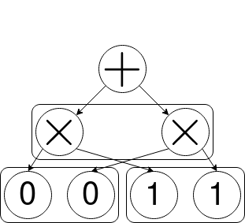

# SPFlow: An Easy and Extensible Library for Probabilistic Circuits

#### Development branch for SPFlow 1.0.0

—

SPFlow is an open-source functional-oriented Python package for Probabilistic Circuits (PCs) with ready-to-use implementations for Sum-Product Networks (SPNs). PCs are a class of powerful deep probabilistic models - expressible as directed acyclic graphs - that allow for tractable querying. This library provides routines for creating, learning, manipulating and interacting with PCs and is highly extensible and customizable.

Cite using: TODO

—

# Table of Contents
* [User Guide](#user-guide)
  * [Backends](#backends)
  * [Creating Models](#creating-models)
  * [Backend Conversion](#backend-conversion)
  * [Interacting with Models](#interacting-with-models)
* [Developer Guide](#user-guide)
  * [Custom Modules](#custom-modules)
  * [Implementing Dispatched Routines](#implementing-dispatched-routines)

# User Guide
## Backends

SPFlow provides two distinct backend representations with one-to-one mappings for models between both. Although we strive to implement most of the libraries functionalities in a backend-agnostic way, some features may only be available in certain backends. See below for more details.

### `base` Backend

The `base` backend uses node-first NumPy representations and serves as the common link between other, more optimized, backends. "Node-first" means that all nodes are explicitly modeled and any higher level modules (e.g., layers) use nodes as their most basic building blocks. This has two advantages. Firstly, prototyping is fast and easy, since the responsibility of computations can simply be handed over to the node implementations. Secondly, it allows for the inspection and manipulation of all individual nodes of a model. For example, one might want to use alternative evaluation routines for certain types of nodes (e.g., to compute certain statistics of interest or for experimental purposes). In this case, it is sufficient to provide an alternative implementation for the node, instead of having to provide alternative routines for any module (node, layer or otherwise) representing or or more nodes of the desired type (see #dispatch for more details).

### `torch` Backend

The `torch` backend provides optimized PyTorch representations, where nodes do no longer need to be modeled explicitly, enabling more efficient computations. Furthermore, the `torch` backend benefits of all of PyTorch's features and workflows, like GPU-based computations or gradient-based optimization.

## Creating Models

### Scopes

`Scope` objects represent scopes of features, denoted by indices. A scope contains two parts. The `query` of the scopes indicates the features, the scope represents. The `evidence` of the scopes contains any features that the `query` features are conditionals of (empty for non-conditional scopes).
```python
from spflow.meta.data import Scope

scope = Scope([0,4,3], [1,2]) # scope over indices 0,4,3 conditional on indices 1,2
```
Scopes are generally only explicitly specified for leaf distributions, and inferred recursively for nodes higher in the graph structure.

### Modules

Models in SPFlow are built from Modules, that can represent one ore more nodes and there are different ways to create models. One way is to create a graph manually using nodes:
```python
from spflow.meta.data import Scope
import spflow.<backend>.structure.spn as spn

model = spn.SumNode(
            children=[
                spn.ProductNode(
                    children=[
                        spn.Gaussian(Scope([0]), mean=-1.0, std=0.5),
                        spn.Gaussian(Scope([1]), mean=1.0, std=1.2),
                    ]),
                spn.ProductNode(
                    children=[
                        spn.Gaussian(Scope([0]), mean=2.5, std=1.0),
                        spn.Gaussian(Scope([1]), mean=1.0, std=0.7),
                    ])
            ],
            weights = [0.3, 0.7]
        )
```
The resulting graph structure can be visualized as follows:


Working with individual nodes directly may quickly get tedious when creating larger models. The same graph can instead also be created using layers, representing multiple nodes:
```python
from spflow.meta.data import Scope
import spflow.<backend>.structure.spn as spn

model = spn.SumNode(
            children=[
                spn.HadamardLayer(
                    child_partitions=[
                        [spn.GaussianLayer(scope=Scope([0]), n_nodes=2, mean=[-1.0, 2.5], std=[0.5, 1.0])],
                        [spn.GaussianLayer(scope=Scope([1]), n_nodes=2, mean=[1.0, 0.5], std=[1.2, 0.7])]
                    ])
                ],
                weights = [0.3, 0.7]
        )
```



In addition to being easier, layers may benefit from performance boots in optimized backends. Nodes and layers can be further combined and nested into new modules, building even more powerful and high-level building blocks or entire models. One example -- shipped with SPFlow -- are random and tensorized SPNs (RAT-SPNs):
```python
from spflow.meta.data import Scope, FeatureTypes, FeatureContext
from spflow.<backend>.structure.spn.rat import RatSPN, random_region_graph

scope = Scope(list(range(1024)))
model = RatSPN(random_region_graph(scope, replicas=2, depth=4, n_splits=2),
            FeatureContext(scope, domains=[FeatureTypes.Gaussian] * len(scope)),
            n_root_nodes = 3,
            n_region_nodes = 2,
            n_leaf_nodes = 4
        )
```
Refer to more (DEVELOPER GUIDE, CUSTOM MODULES) for more details on how to declare custom modules.

### AutoLeaf

When creating a model, it is sometimes not clear which leaf module is the best to use in a given scenario. This is especially true for automated modular architectures like RAT-SPNs or some structure learners (e.g., LearnSPN, see #structure-learning). The AutoLeaf class provides functionality to automatically select and create an appropriate leaf module for one or more given data scopes. The user specifies information about the data in a FeatureContext, for example:
```python
from spflow.meta.data import Scope, FeatureTypes, FeatureContext

feature_ctx = FeatureContext(Scope([0]), [FeatureTypes.Gaussian])
```
The feature context now contains a scope and the specified domain information about the random variables in the scope. In this case the data is univariate and Gaussian-distributed. We could also specify (part of) the parameters of the distribution:
```python
from spflow.meta.data import Scope, FeatureTypes, FeatureContext

feature_ctx = FeatureContext(Scope([0]), [FeatureTypes.Gaussian(mean=1.7, std=0.3)])
```
Notice, that in the first example we used `FeatureTypes.Gaussian`, which is a class, but now we created an instance of the class with specific parameters. `FeatureContext` checks if a class is specified, and automatically creates an instance with default arguments. Therefore, the first example is equivalent to
```python
from spflow.meta.data import Scope, FeatureTypes, FeatureContext

feature_ctx = FeatureContext(Scope([0]), [FeatureTypes.Gaussian()])
```
and is simply a convenient way for specify the distribution of a feature without concrete parameters. Not all feature types can be specified this way. For example, `FeatureTypes.Binomial` requires the non-optional parameter `n` to be specified. Simply passing FeatureTypes.Binomial will then result in an error, when `FeatureContext` tries to instantiate it without the required argument. For all available feature types see FeatureTypes (REF DOCUMNETATION `FeatureTypes`). To specify custom feature types, see (#custom-modules).

Once, we have a feature context, we can now use `AutoLeaf` to automatically deduce the Gaussian leaf node to represent this distribution:
```python
from spflow.meta.data import Scope, FeatureTypes, FeatureContext
from spflow.<backend>.structure import AutoLeaf
from spflow.<backend>.structure.spn import Gaussian

feature_ctx = FeatureContext(Scope([0]), [FeatureTypes.Gaussian()])

leaf_class = AutoLeaf.infer([feature_ctx])
print(leaf_class == Gaussian) # True
```
We can directly instantiate the leaf module by "instantiating" `AutoLeaf`:
```python
from spflow.meta.data import Scope, FeatureTypes, FeatureContext
from spflow.<backend>.structure import AutoLeaf
from spflow.<backend>.structure.spn import Gaussian

feature_ctx = FeatureContext(Scope([0]), [FeatureTypes.Gaussian()])

leaf = AutoLeaf([feature_ctx])
print(isinstance(leaf, Gaussian)) # True
```
Note, that the object returned by instantiating `AutoLeaf`, is not actually an instance of `AutoLeaf`, but of the class returned by `AutoLeaf.infer()`. `AutoLeaf` uses an ordered list of known (i.e., registered) leaf modules, which implement an `accepts()` class-method to determine whether or not a module is able to represent a specified feature context signature. Leaf modules are called in order and the first match is returned. If no appropriate leaf module for given feature contexts can be matched, `AutoLeaf.infer()` will return `None` instead. Similarly, `AutoLeaf()` will raise an exception in this case. The order of the leaf modules in `AutoLeaf` can be used to prioritize leaf modules for certain signatures that may have more than one possible match. For example,
```python
from spflow.meta.data import Scope, FeatureTypes, FeatureContext
from spflow.<backend>.structure import AutoLeaf
from spflow.<backend>.structure.spn import MultivariateGaussian

feature_ctx = FeatureContext(Scope([0, 1]), [
    FeatureTypes.Gaussian(),
    FeatureTypes.Gaussian()
])

leaf = AutoLeaf([feature_ctx])
print(isinstance(leaf, MultivariateGaussian)) # True
```
correclty returns an instance for a multivariate Gaussian distribution. Recall however, that the univariate Gaussian example earlier, matched `Gaussian`, even though the `MultivariateGaussian` class can also represent univariate Gaussians. This is because the `Gaussian` leaf module class is checked before `MultivariateGaussian` by default.
The same principle can be seen in the following example:
```python
from spflow.meta.data import Scope, FeatureTypes, FeatureContext
from spflow.<backend>.structure import AutoLeaf
from spflow.<backend>.structure.spn import GaussianLayer

feature_contexts = [
    FeatureContext(Scope([0]), [FeatureTypes.Gaussian()]),
    FeatureContext(Scope([1]), [FeatureTypes.Gaussian()])
]

leaf = AutoLeaf(feature_contexts)
print(isinstance(leaf, GaussianLayer)) # True
```
`AutoLeaf` correctly matches `GaussianLayer`, since we now passed multiple feature context as a signature, which cannot be represented by a single Gaussian object. However, `GaussianLayer` can also represent single distributions. But as seen earlier, passing a single feature context will match `Gaussian` instead, because it is checked before `GaussianLayer`. To change the priorities (i.e., order) of known leaf modules, see `AutoLeaf` (CLASS AutoLeaf). To learn how to create and register a custom leaf module, see (#custom-modules).

### Structure Learning

Instead of manually creating a model architecture, one can also use a structure learner. SPFlow ships with an implementation of the LearnSPN algorithm (CITE) for learning the architecture of Sum-Product Networks (REF). A simple example:
```python
from spflow.<backend>.learning.spn import learn_spn

spn = learn_spn(data, feature_ctx)
```
The algorithm uses randomized dependence coefficients (RDCs) to determine (in)dependencies between features for partitioning and k-Means clustering to divide the input data instances. However, custom partitioning and clustering methods can be specified. Note, that LearnSPN also learns the parameter values by default. For more details see (REF DOCUMENTATION `learn_spn`).

## Backend Conversion

Due to the one-to-one mappings between different backends, converting a model from one backend to another is as simple as:
```python
from spflow.torch.structure import toBase, toTorch

torch_model = toTorch(model)
base_model = toBase(torch_model)
```
Note: the backend-conversion routines are only available in the optimized backends' namespaces, since the `base` backend does not know about any other backend.

## Interacting With Models

Interacting with models usually involves a data set of some kind. Data is specified in two-dimensional backend-specific data containers - `np.ndarray` and `torch.Tensor` for the `base` and `torch` backends, respectively. Each row of the data container is regarded as a distinct data instance. The columns represent the features in the data set and the column indices should correspond to the scope indices. Missing feature values are represented as `NaN` values.

### Inference

For inference, SPFlow offers the computation of the likelihoods and log-likelihoods of data for models. Inference takes a two-dimensional data set and returns a two-dimensional array containing the (log-)likelihoods, where each row corresponds to an input data instance. The number of columns corresponds to the number of outputs of the module inference is performed on.
```python
from spflow.<backend>.inference import log_likelihood, likelihood

likelihoods = likelihood(model, data)
log_likelihoods = log_likelihood(model, data)
```
Missing data (i.e., `NaN` values) is implicitly marginalized over. This means that a completely missing data instance (all `NaN` row) outputs a likelihood of `1` (and corresponding log-likelihood of `0`).

### Sampling

SPFlow can also sample data from models, possibly in the presence of evidence. Generating a sample from a model can be done as follows:
```python
from spflow.<backend>.sampling import sample

sample = sample(model)
```
Drawing multiple samples at once can be done similary, by providing the number of target samples to generate:
```python
from spflow.<backend>.sampling import sample

samples = sample(model, 100)
```
In the case of evidence, a partially filled data set is passed to sample instead:
```python
from spflow.<backend>.sampling import sample

data = sample(model, data)
```
The routine fills the data tensor in-place, taking specified evidence into account. Keeping track of the return value should not be necessary this case, since the input data set should be modified in-place. However, it is good-practice to (re-)assign it nonetheless. Note, that `sample(model)` and `sample(model, n)` are simply convenient aliases that create an empty data set of appropriate shape to fill with generated values.

#### Sampling Context

The `SamplingContext` class controls the sampling process and is passed to the sampling routing. It is mostly used internally, although users can use it manually if needed. It consists of two parts: a list of instance indices of the data set to sample and a list of lists of output indices, specifying the outputs of the module to sample. For example (in the `base` backend here, but works analogously in the `torch` backend):
```python
import numpy as np
from spflow.meta.data import Scope
from spflow.meta.dispatch import SamplingContext
from spflow.base.structure.spn import GaussianLayer
from spflow.base.sampling import sample

# create a layer consisting of three univariate Gaussians (the first two with scope 0 and the last one with scope 1)
model = GaussianLayer(scope=[Scope([0]), Scope([0]), Scope([1])])

# initialize empty data set
data = np.full((4, 2), np.NaN, dtype=float)

# create sampling context
sampling_ctx = SamplingContext(instance_ids=[0, 3], output_ids=[[0], [1, 2]])

# sample
data = sample(model, data, sampling_ctx=sampling_ctx)

print(~np.isnan(data))
#  True, False
# False, False
# False, False
#  True,  True
```
Note, that the sampling context should always be passed as keyword argument `sampling_ctx`, in order to be recognized correctly during dispatch. In the example the sampling context indicates that the instances indices `0` and `3` should be sampled. The first one from the output with index `0` (corresponding to the first Gaussian of the layer with scope `0`) and the latter from the output indices `1` and `2` (corresponding to the second and last Gaussians with scopes `0` and `1`, respectively).
Notice, that in the example above we sample one instance from multiple outputs. This is only possible if the scopes of the outputs are pair-wise disjoint. For example, the following will result in an error:
```python
import numpy as np
from spflow.meta.data import Scope
from spflow.meta.data import SamplingContext
from spflow.base.structure.spn import GaussianLayer
from spflow.base.sampling import sample

# create a layer consisting of three univariate Gaussians (the first two with scope 0 and the last one with scope 1)
module = GaussianLayer(scope=[Scope([0]), Scope([0]), Scope([1])])

# initialize empty data set
data = np.full((4, 2), np.NaN)

# create sampling context
sampling_ctx = SamplingContext(instance_ids=[0], output_ids=[[0, 1]])  # sample from outputs with overlapping (here: same) scope

# sample
data = sample(model, data, sampling_ctx=sampling_ctx) # will raise an exception
```
Passing an empty list as output indices for a single instance (e.g., `SamplinContext([0], [[]])`), is a convention to sample from all output values.

### Parameter Learning


SPFlow implements maximum-(weighted-)likelihood to fit parameters for leaf modules only. For example:
```python
from spflow.<backend>.learning import maximum_likelihood_estimation

maximum_likelihood_estimation(leaf, data)
```

The `torch` backend additionally implements expectation maximization (EM) to iteratively optimize models:
```python
from spflow.<backend>.learning import expectation_maximization

expectation_maximization(model, data)
```
Since PyTorch ships offers automatic differentiation, we can also use gradient-based optimization in the `torch` backend, in a PyTorch-typical workflow:
```python
from torch.optim import SGD
from spflow.torch.inference import log_likelihood

optim = SGD(model.parameters(), lr=0.01)

# compute negative cumulative log-likelihoods
nll = -log_likelihood(model, data).sum()
nll.backward()

# perform gradient step
optim.step()
```
For ease-of-use SPFlow provides a convenient routine that can optimize the model for you: TODO.

### Dispatch

Internally, SPFlow uses dispatch to call the correct implementation based on the specified module classes. All dispatched functions accept a `dispatch_ctx` keyword argument, taking a `DispatchContext` instance. Amongst other things, this takes care of memoization. In most cases the dispatch context is created automatically. However, there are a few scenarios in which users might want to deal with the dispatch context directly. For example, for routines using memoization, like (log-)likelihood, the dispatch context stores the outputs of all modules:
```python
from spflow.meta.dispatch import DispatchContext
from spflow.<backend>.inference import log_likelihood

# create dispatch context
dispatch_ctx = DispatchContext()

# compute log likelihoods
log_likelihoods = log_likelihood(model, data, dispatch_ctx=dispatch_ctx)

# inspect cached log-likelihood outputs
print(dispatch_ctx.cache['log_likelihood'])
```
This can be used for better inspection of models. Furthermore, cached values can sometimes be re-used in other routines, for example:
```python
from spflow.meta.dispatch import DispatchContext
from spflow.<backend>.inference import log_likelihood
from spflow.<backend>.sampling import sample

# create dispatch context
dispatch_ctx = DispatchContext()

# compute log likelihoods
log_likelihoods = log_likelihood(model, data, dispatch_ctx=dispatch_ctx)

# compute sampling from evidence, re-using cached log-likelihoods
data = sample(model, data, dispatch_ctx=dispatch_ctx)
```
In this case the cached log-likelihood values (required for sampling in the presence of evidence) are re-used instead of being computed again.

The dispatch context can also be used to specify alternative evaluation functions for modules of a certain type. This may be useful for experimental purposes or to extract metrics of interest. This can be done as follows (example in `base` backend, analogously in `torch` backend):
```python
import numpy as np
from spflow.meta.data import Scope
from spflow.meta.dispatch import DispatchContext
from spflow.base.structure.spn import Gaussian
from spflow.base.inference import log_likelihood

model = Gaussian(Scope([0]))
data = np.random.randn(10, 1)

# dummy function that simply outputs 1's
def alternative_f(gaussian, data, *args, **kwargs):
    return np.ones((data.shape[0], 1))

# create dispatch context
dispatch_ctx = DispatchContext()
dispatch_ctx.funcs[Gaussian] = alternative_f

# compute log likelihoods using alternative_f for all instances of type Gaussian in 'model'
log_likelihoods = log_likelihood(model, data, dispatch_ctx=dispatch_ctx)
print(log_likelihoods)
```
Note, that the alternative function must have the same argument signature as the originally dispatched function. This functionality makes most sense in the base backend since all models are constructed from explicitly modeled nodes. That means, that in order to evaluate all nodes of certain type differently, it should be sufficient to provide an alternative implementation for the node type, instead of all nodes, layers or other modules that may be optimized and do not contain any explicit nodes.

Another use-case is the passing of additional arguments to specific module instances. For example, the conditional modules available in SPFlow accept parameter values to be set from the outside and passed via the dispatch cache to module:
```python
from spflow.meta.data import Scope
from spflow.meta.dispatch import DispatchContext
from spflow.<backend>.structure.spn import CondGaussian
from spflow.<backend>.inference import log_likelihood

# create conditional Gaussian leaf
cond_gaussian = CondGaussian(Scope([0]))

# create dispatch context
dispatch_ctx = DispatchContext()
dispatch_ctx.update_args(cond_gaussian, {'p': 0.8})

# compute log likelihoods (value of 'p' is read out of the dispatch context by CondGaussian)
log_likelihoods = log_likelihood(cond_gaussian, data, dispatch_ctx=dispatch_ctx)
```
For more details on conditional modules, see for example (REF DOCUMENTATION: `CondGaussian`).

—

# Development Guide

This article explains how to develop new features for and using the SPFlow library.

## Custom Modules

`spflow.meta.structure.MetaModule` is the fundamental class for all modules in any backend, but should not be used directly. Instead, each backend provides a basic abstract subclass `spflow.<backend>.structure.Module` thereof, that all modules in the backend should inherit from (or a subclass of it). Each module should implement the `n_out` and `scopes_out` properties. The first should be an integer, indicating the number of outputs the module represents. The latter is a list of `Scope` objects, containing the scopes of each corresponding outputs. Inheriting classes should also explicitely call the super-class's `__init__` with the list of child modules as an argument, which will set the child modules correctly. The following can be used as a starting template:
```python
from spflow.<backend>.structure import Module

class MyModule(Module):
    def __init__(self, children: List[Module]) -> None:
        super(MyNestedModule, self).__init__(children=children)

        ...
```

`spflow.<backend>.structure.Node` is an abstract base class and subclass of `spflow.<backend>.structure.Module`, that can be used for nodes. It already initializes the number of outputs to `1`. The `spflow.<backend>.structure.LeafNode` class is intended for leaf nodes and additionally initialized the module to have no children.

In some cases a module contains other non-terminal modules (e.g., layers of sum or product nodes). However, SPFlow requires all children to be set at creation, in which case we do not want the internal modules to point to the outer modules children, too. For this scenario, one should use `spflow.<backend>.structure.NestedModule`. `NestedModule` contains a `Placeholder` module class, that acts as a mediator between the parent module and the outer module's children. A simple example:
```python
from spflow.<backend>.structure import Module, NestedModule
from spflow.<backend>.structure.spn import SumNode

class MyNestedModule(NestedModule):
    def __init__(self, children: List[Module]) -> None:
        super(MyNestedModule, self).__init__(children=children)

        # number of total inputs
        n_in = sum([child.n_out for child in children])

        # create placeholder
        ph = self.create_placeholder(list(range(n_in))
                                     
        # wrap a single sum node (with placeholder as child)
        self.node = SumNode(children=[ph])
        
        ...
```
Although the example above is unreasonable, it illustrates how to use the input placeholders. During interaction with the module the placeholders values can be set using `spflow.<backend>.structure.NestedModule.set_placeholder(f_name, <all_inputs>, dispatch_ctx)` and the needed input values are automatically extracted and set in the dispatch context cache for the appropriate routine (e.g., `log_likelihood`).

#### Notes on `base` Backend

Remember, that all (official) modules in the `base` backend must always explicitly model nodes as `spflow.base.structure.Node` objects.

#### Notes on `torch` Backend

`spflow.torch.structure.Module` additionally inherits from `torch.nn.Module`, making all subclasses proper PyTorch modules. Children are set using `torch.nn.Module.add_module()` and are iterated over using the `torch.nn.Module.children()` method (instead of a list of modules as in the `base` backend). This will make the children part of the module and their parameters available in `torch.nn.Module.parameters()`. For the same reason, any internally used modules (that are not children) should be tracked in a `torch.nn.ModuleList`. Learnable parameters can be declared using `torch.nn.Module.register_parameter()` and non-learnable parameters using `torch.nn.Module.register_buffer()`. To avoid invalid values for bounded parameters (e.g., when using gradient-based optimization), it may help to use unbounded parameters instead and project them into the valid range for inference, etc. `spflow.torch.utils.projections` contains some projection functions used in SPFlow.

### Structural Marginalization

TODO

## Implementing Dispatched Routines

Internally, dispatching is achieved through the `plum-dispatch` package. However, SPFlow provides a convenient `spflow.meta.dispatch.dispatch` decorator that offers automatic memoization and other features. This is the standard way of dispatching, although `plum.dispatch` can be used directly if needed.

Sometimes it is helpful to determine the actual child and corresponding output index for a given input index. This can be done using `spflow.<backend>.structure.Module.input_to_output_ids()` (REF DOCUMENTATION: `Module`).

### Inference

Per default, all modules should implement a `log_likelihood` routine. `likelihood` is dispatched to be the exponential of `log_likelihood` for all modules  per default, but can be overridden if needed.

The implementation for `log_likelihood` should adhere to the following outline (in the `base` backend, but analogously in the `torch` backend):
```python
import numpy as np
from spflow.meta.dispatch import dispatch, DispatchContext, init_default_dispatch_context

@dispatch(memoize=True) # memoization makes sure that values are not computed multiple times
def log_likelihood(module: MyModule, data: np.ndarray, check_support: bool=True, dispatch_ctx: Optional[DispatchContext]=None) -> np.ndarray:

    # initialize dispatch context (creates empty dispatch context if None)
    dispatch_context = init_default_dispatch_context(dispatch_ctx)

    ...
```
`check_support` is an argument that indicates whether or not to check if the data is in the support of the leaf distributions (relevant for the leaf modules). Can be disabled to speed up computations. `NaN` values in `data` should be marginalized over.
If `MyModule` calls `log_likelihood` on other modules, all arguments with default values (i.e., `check_support`, `dispatch_ctx`) should be passed along as explicit keyword arguments, due to `plum-dispatch`'s internal implementation.

### Sampling

The implementation for `sample` should adhere to the following outline (in the `base` backend, but analogously in the `torch` backend):
```python
import numpy as np
from spflow.meta.dispatch import dispatch, DispatchContext, init_default_dispatch_context, SamplingContext, init_default_sampling_context

@dispatch
def sample(module: MyModule, data: np.ndarray, check_support: bool=True, dispatch_ctx: Optional[DispatchContext]=None, sampling_ctx: Optional[DispatchContext]=None) -> np.ndarray:

    # initialize dispatch context (creates empty dispatch context if None)
    dispatch_context = init_default_dispatch_context(dispatch_ctx)
    # initialize sampling context (creates sampling context that samples all instances and all outputs)
    sampling_context = init_default_sampling_context(sampling_ctx, data.shape[0])

    ...
```
`check_support` is an argument that indicates whether or not to check if the data is in the support of the leaf distributions (relevant for the leaf modules). Can be disabled to speed up computations. The sampling context indicates which instances in `data` to fill with sampled values and which outputs of `MyModule` to sample from (relevant for multi-output modules). `data` should be filled in-place, but also returned. Evidence (i.e., non-`NaN` values) should be taken into account.

If `MyModule` calls `sample` on other modules, all arguments with default values (i.e., `check_support`, `dispatch_ctx`, `sampling_ctx`) should be passed along as explicit keyword arguments, due to `plum-dispatch`'s internal implementation.

### Learning

The implementation for `maximumg_likelihood_estimation` should adhere to the following outline (in the `base` backend, but analogously in the `torch` backend):
```python
import numpy as np
from spflow.meta.dispatch import dispatch, DispatchContext, init_default_dispatch_context

@dispatch(memoize=True) # makes sure that module parameters are only estimated once
def maximum_likelihood_estimation(module: MyModule, data: np.ndarray, weights: Optional[np.ndarray]=None, bias_correction: bool=True, nan_strategy: Optional[Union[str, Callable]]=None, check_support: bool=True, dispatch_ctx: Optional[DispatchContext]=None) -> None:

    # initialize dispatch context (creates empty dispatch context if None)
    dispatch_context = init_default_dispatch_context(dispatch_ctx)

    ...
```
`check_support` is an argument that indicates whether or not to check if the data is in the support of the leaf distributions (relevant for the leaf modules). Can be disabled to speed up computations.
`bias_correction` indicates whether or not to correct biases (if applicable).
`nan_strategy` indicates how to handle missing values.
If no `weights` are specified, they should be initialized to all ones.
If `MyModule` calls `maximum_likelihood_estimation` on other modules, all arguments with default values (i.e., `weights`, `nan_strategy`, `check_support`, `dispatch_ctx`) should be passed along as explicit keyword arguments, due to `plum-dispatch`'s internal implementation.

The implementation for `em` should adhere to the following outline (in the `torch` backend, since `base` does not support EM):
```python
import torch
from spflow.meta.dispatch import dispatch, DispatchContext, init_default_dispatch_context

@dispatch(memoize=True) # makes sure that module parameters are only update once per step
def em(module: MyModule, data: torch.Tensor, check_support: bool=True, dispatch_ctx: Optional[DispatchContext]=None) -> None:

    # initialize dispatch context (creates empty dispatch context if None)
    dispatch_context = init_default_dispatch_context(dispatch_ctx)

    with torch.no_grad():
        ...
```
Note: per default `spflow.torch.learning.expectation_maximization` performs a `log_likelihood` forward pass, calls `retain_grad()` on the cached output log-likelihoods of all modules (if `requires_grad=True`) and computes `backward()` on the sum. Modules that require access to the gradients of the log-likelihoods can then access them through the dispatch cache.
`check_support` is an argument that indicates whether or not to check if the data is in the support of the leaf distributions (relevant for the leaf modules). Can be disabled to speed up computations.
If `MyModule` calls `em` on other modules, all arguments with default values (i.e., `check_support`, `dispatch_ctx`) should be passed along as explicit keyword arguments, due to `plum-dispatch`'s internal implementation.

### Backend Conversion

The implementation for `toBase`,`toTorch` should adhere to the following outline (in the `base` backend, but analogously in the `torch` backend):
```python
from spflow.meta.dispatch import dispatch, DispatchContext, init_default_dispatch_context

@dispatch(memoize=True) # makes sure that an object is only converted once and used in all places
def toTorch(module: MyModule, dispatch_ctx: Optional[DispatchContext]=None) -> MyTorchModule:

    # initialize dispatch context (creates empty dispatch context if None)
    dispatch_context = init_default_dispatch_context(dispatch_ctx)

    ...

@dispatch(memoize=True) # makes sure that an object is only converted once and used in all places
def toBase(module: MyTorchModule, dispatch_ctx: Optional[DispatchContext]=None) -> MyModule:

    # initialize dispatch context (creates empty dispatch context if None)
    dispatch_context = init_default_dispatch_context(dispatch_ctx)

    ...
```
If `MyModule` calls `toBase`,`toTorch` on other modules, all arguments with default values (i.e., `dispatch_ctx`) should be passed along as explicit keyword arguments, due to `plum-dispatch`'s internal implementation.

### AutoLeaf

If a custom module is implemented and should be supported by `AutoLeaf` it should implement the following class methods:
```python
from spflow.meta.data import FeatureContext
from spflow.<backend>.structure import Module

class MyModule(Module):
    ...

    @classmethod
    accepts(cls, signature: List[FeatureContext]) -> bool:
        ...
    
    @classmethod
    from_signatures(cls, signatures: List[FeatureContext]) -> "MyModyle":
        ...

```
It can then be registered using `AutoLeaf.register()`.

To create a new feature type, one should subclass `spflow.meta.data.FeatureType`, similar to:
```python
from spflow.meta.data import MetaType, FeatureContext
from spflow.<backend>.structure import Module
from typing import Any

class MyFeatureType(FeatureType):
    meta_type: MetaType # required class attribute
    ...
    def __init__(self, required_param, optional_param=0.5):
        ...
```
The feature type can then be registered using `spflow.meta.data.FeatureTypes.register()` to be accessed conveniently through the `spflow.meta.data.FeatureTypes` class, along all other feature types.
