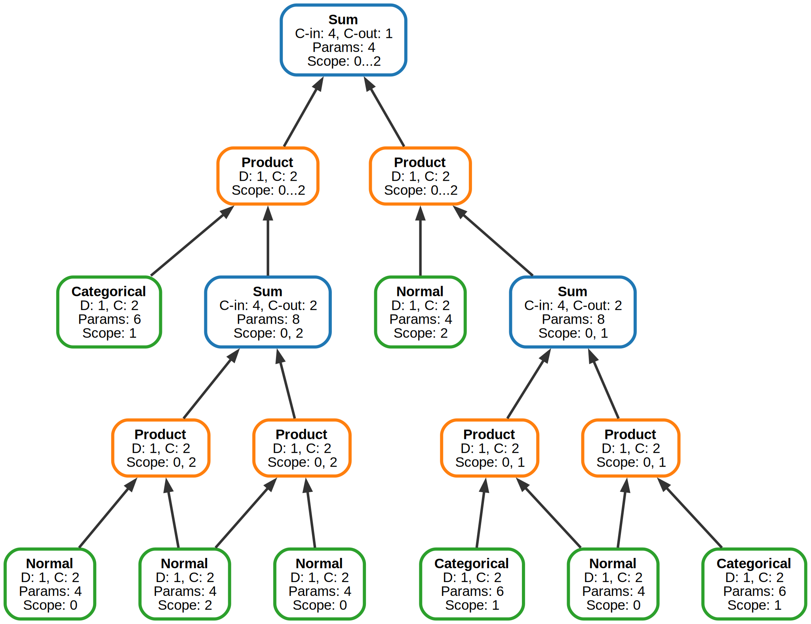
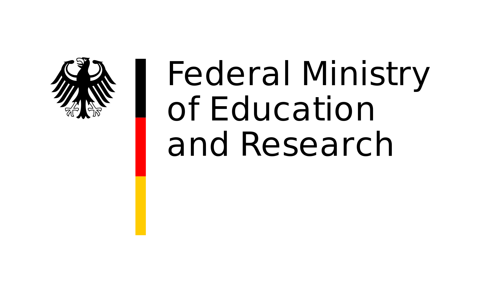

# SPFlow: An Easy and Extensible Library for Probabilistic Circuits

[](https://www.python.org/downloads/)
[](https://github.com/SPFlow/SPFlow/blob/master/LICENSE)
[](https://black.readthedocs.io/en/stable/)
[](https://codecov.io/gh/SPFlow/SPFlow)
[](https://semver.org/)

> **NOTE**: SPFlow 1.0.0 is a complete rewrite of SPFlow using PyTorch and has not yet been officially released. The pre-v1.0.0 version is still available on PyPI (`spflow==0.0.46`) and in the `legacy` branch of this repository.

**SPFlow** is a flexible, modular library for building and reasoning with **Sum-Product Networks (SPNs)** and **Probabilistic Circuits (PCs)**. These are deep generative and discriminative models that enable tractable (polynomial-time) probabilistic inference while maintaining expressive power. SPFlow is built on [PyTorch](https://pytorch.org/), providing GPU acceleration and seamless integration with modern deep learning workflows.

**Key capabilities:**
- Exact probabilistic inference: marginals, conditionals, most probable explanations
- Flexible model construction: manual design or automatic structure learning
- Multiple learning algorithms: gradient descent, expectation-maximization, structure learning
- Full support for missing data and various distribution types
- GPU acceleration via PyTorch

## Installation

### Option 1: PyPI Installation (Recommended for Users)

```bash
pip install spflow
```

### Option 2: Development Installation

Clone the repository and install with development dependencies:

```bash
git clone https://github.com/SPFlow/SPFlow.git
cd SPFlow
uv sync --extra dev
```

## Quick Start

Here are three quick examples to get you started:

### Example 1: Manual SPN Construction

```python
import torch
from spflow.modules.sums import Sum
from spflow.modules.products import Product
from spflow.modules.leaves import Normal
from spflow.meta import Scope

# Create leaves layer for 2 features
scope = Scope([0, 1])
leaf_layer = Normal(scope=scope, out_channels=4)

# Combine with product and sum nodes
product = Product(inputs=leaf_layer)
model = Sum(inputs=product, out_channels=2)

# Compute log-likelihood on some data
data = torch.randn(32, 2)  # 32 samples, 2 features
log_likelihood_output = model.log_likelihood(data)

print(f"Model:\n{model.to_str()}")
print(f"Data shape: {data.shape}")
print(f"Log-likelihood output shape: {log_likelihood_output.shape}")
print(f"Log-likelihood sample: {log_likelihood_output[0]}")
```

Output:
```
Model:
Sum [D=1, C=2] [weights: (1, 4, 2)] → scope: 0-1
└─ Product [D=1, C=4] → scope: 0-1
   └─ Normal [D=2, C=4] → scope: 0-1
Data shape: torch.Size([32, 2])
Log-likelihood output shape: torch.Size([32, 1, 2])
Log-likelihood sample: tensor([[-3.1183, -3.8367]], grad_fn=<SelectBackward0>)
```

### Example 2: RAT-SPN (Randomized & Tensorized)

```python
import torch
from spflow.modules.rat import RatSPN
from spflow.modules.leaves import Normal
from spflow.meta import Scope

# Create leaves layer
num_features = 64
scope = Scope(list(range(num_features)))
leaf_layer = Normal(scope=scope, out_channels=4, num_repetitions=2)

# Create and use RAT-SPN model
data = torch.randn(100, num_features)
model = RatSPN(
    leaf_modules=[leaf_layer],
    n_root_nodes=1,
    n_region_nodes=8,
    num_repetitions=2,
    depth=3,
    outer_product=False
)

log_likelihood_output = model.log_likelihood(data)

print(f"Data shape: {data.shape}")
print(f"Log-likelihood output shape: {log_likelihood_output.shape}")
print(f"Log-likelihood - Mean: {log_likelihood_output.loc():.4f}, Std: {log_likelihood_output.scale():.4f}")
print(f"Log-likelihood sample: {log_likelihood_output[0]}")
```

Output:
```
Data shape: torch.Size([100, 64])
Log-likelihood output shape: torch.Size([100, 1, 1])
Log-likelihood - Mean: -477.4794, Std: 131.2834
Log-likelihood sample: tensor([[[-873.5844]]], grad_fn=<SliceBackward0>)
```

### Example 3: Structure Learning with LearnSPN

```python
import torch
from spflow.learn import learn_spn
from spflow.modules.leaves import Normal
from spflow.meta import Scope

torch.manual_seed(42)

# Create leaves layer with Gaussian distributions
scope = Scope(list(range(5)))
leaf_layer = Normal(scope=scope, out_channels=4)

# Learn SPN structure from data
# Construct synthetic data for demonstration with five different clusters
torch.manual_seed(0)
cluster_1 = torch.randn(200, 5) + torch.tensor([0, 0, 0, 0, 0])
cluster_2 = torch.randn(200, 5) + torch.tensor([5, 5, 5, 5, 5])
cluster_3 = torch.randn(200, 5) + torch.tensor([-5, -5, -5, -5, -5])
data = torch.vstack([cluster_1, cluster_2, cluster_3]).float()
model = learn_spn(
    data,
    leaf_modules=leaf_layer,
    out_channels=1,
    min_instances_slice=100
)

# Use the learned model
log_likelihood_output = model.log_likelihood(data)

print(f"Learned model structure: {model.to_str()}")
print(f"Data shape: {data.shape}")
print(f"Log-likelihood output shape: {log_likelihood_output.shape}")
print(f"Log-likelihood - Mean: {log_likelihood_output.mean():.4f}, Std: {log_likelihood_output.std():.4f}")
print(f"Log-likelihood sample: {log_likelihood_output[0]}")
```

Output:
```
used 4 iterations (0.0007s) to cluster 600 items into 2 clusters
used 3 iterations (0.0003s) to cluster 398 items into 2 clusters
Learned model structure: Sum [D=1, C=1] [weights: (1, 5, 1)] → scope: 0-4
├─ Sum [D=1, C=1] [weights: (1, 8, 1)] → scope: 0-4
│  ├─ Product [D=1, C=4] → scope: 0-4
│  │  ├─ Normal [D=1, C=4] → scope: 0-0
│  │  ├─ Normal [D=1, C=4] → scope: 1-1
│  │  ├─ Normal [D=1, C=4] → scope: 2-2
│  │  ├─ Normal [D=1, C=4] → scope: 3-3
│  │  └─ Normal [D=1, C=4] → scope: 4-4
│  └─ Product [D=1, C=4] → scope: 0-4
│     ├─ Normal [D=1, C=4] → scope: 0-0
│     ├─ Normal [D=1, C=4] → scope: 1-1
│     ├─ Normal [D=1, C=4] → scope: 2-2
│     ├─ Normal [D=1, C=4] → scope: 3-3
│     └─ Normal [D=1, C=4] → scope: 4-4
└─ Product [D=1, C=4] → scope: 0-4
   ├─ Normal [D=1, C=4] → scope: 0-0
   ├─ Normal [D=1, C=4] → scope: 1-1
   ├─ Normal [D=1, C=4] → scope: 2-2
   ├─ Normal [D=1, C=4] → scope: 3-3
   └─ Normal [D=1, C=4] → scope: 4-4
Data shape: torch.Size([600, 5])
Log-likelihood output shape: torch.Size([600, 1, 1])
Log-likelihood - Mean: -8.1063, Std: 1.5230
Log-likelihood sample: tensor([[-7.4175]], grad_fn=<SelectBackward0>)
```

### Example 4: Sampling from a Sum-Product Network

```python
import torch
from spflow.modules.sums import Sum
from spflow.modules.leaves import Normal
from spflow.meta import Scope
from spflow.utils.sampling_context import  SamplingContext

torch.manual_seed(42)

# Create a simple SPN with 3 features
scope = Scope([0, 1, 2])
leaf_layer = Normal(scope=scope, out_channels=2)
model = Sum(inputs=leaf_layer, out_channels=1)

# Sample from the model
n_samples = 2
out_features = model.out_features
evidence = torch.full((n_samples, out_features), torch.nan)  # No conditioning
channel_index = torch.full((n_samples, out_features), 0, dtype=torch.int64)  # Sample from first channel
mask = torch.full((n_samples, out_features), True, dtype=torch.bool)
sampling_ctx = SamplingContext(channel_index=channel_index, mask=mask)

samples = model.sample(data=evidence, sampling_ctx=sampling_ctx)

# Compute log-likelihood for the samples
log_likelihood_output = model.log_likelihood(samples)

print(f"Model:\n{model.to_str()}")
print(f"Generated samples shape: {samples.shape}")
print(f"Samples:\n{samples}")
print(f"Log-likelihood of samples shape: {log_likelihood_output.shape}")
print(f"Log-likelihood sample: {log_likelihood_output[0]}")
```

Output:
```
Model:
Sum [D=3, C=1] [weights: (3, 2, 1)] → scope: 0-2
└─ Normal [D=3, C=2] → scope: 0-2
Generated samples shape: torch.Size([2, 3])
Samples:
tensor([[ 0.1607,  0.6218, -1.1670],
        [ 0.5427,  0.3331, -0.6964]])
Log-likelihood of samples shape: torch.Size([2, 3, 1])
Log-likelihood sample: tensor([[-0.4677],
        [-0.5822],
        [-1.4382]], grad_fn=<SelectBackward0>)
```

### Example 5: Temporary Method Replacement

SPFlow further supports substituting methods of modules for temporary modified method calls, e.g. replacing the sum operation in the `Sum` module with a max operation:

```python
import torch
from spflow.modules.sums import Sum
from spflow.modules.products import Product
from spflow.modules.leaves import Normal
from spflow.meta import Scope
from spflow.utils import replace

torch.manual_seed(1)

# Create a probabilistic circuit: Product(Sum(Product(Normal)))
scope = Scope([0, 1])
normal = Normal(scope=scope, out_channels=4)
inner_product = Product(inputs=normal)
sum_module = Sum(inputs=inner_product, out_channels=1)
root_product = Product(inputs=sum_module)

# Create test data
data = torch.randn(3, 2)

# Normal inference
log_likelihood_original = root_product.log_likelihood(data).flatten()
print(f"Original log-likelihood: {log_likelihood_original}")

# Define a custom log_likelihood for Sum modules
def max_ll(self, data, cache=None):
    ll = self.inputs.log_likelihood(data, cache=cache).unsqueeze(3)
    weighted_lls = ll + self.log_weights.unsqueeze(0)
    return torch.max(weighted_lls, dim=self.sum_dim + 1)[0]

# Temporarily replace Sum.log_likelihood with custom implementation
with replace(Sum.log_likelihood, max_ll):
    log_likelihood_custom = root_product.log_likelihood(data).flatten()
    print(f"Custom log-likelihood:   {log_likelihood_custom}")

# Original method is automatically restored
log_likelihood_restored = root_product.log_likelihood(data).flatten()
print(f"Restored log-likelihood: {log_likelihood_restored}")
```
Output:
```
Original log-likelihood: tensor([-1.2842, -2.8750, -7.2442], grad_fn=<ViewBackward0>)
Custom log-likelihood:   tensor([-1.4334, -3.5256, -7.9031], grad_fn=<ViewBackward0>)
Restored log-likelihood: tensor([-1.2842, -2.8750, -7.2442], grad_fn=<ViewBackward0>)
```

## Example 6: Graph Visualization

``` python
import torch
from spflow.modules import Sum, Product
from spflow.modules.leaf import Normal, Categorical
from spflow.meta.data.scope import Scope


# Define feature indices: X=0, Z1=1, Z2=2
X_idx = 0
Z1_idx = 1
Z2_idx = 2

# ===== Leaf modules =====
# For left branch: Z1 with Sum[X, Z2]
leaf_Z1_left = Categorical(scope=Scope([Z1_idx]), out_channels=2, K=3)
leaf_X_1 = Normal(scope=Scope([X_idx]), out_channels=2)
leaf_Z2_1 = Normal(scope=Scope([Z2_idx]), out_channels=2)
leaf_X_2 = Normal(scope=Scope([X_idx]), out_channels=2)

# For right branch: Z2 with Sum[Z1, X]
leaf_Z2_right = Normal(scope=Scope([Z2_idx]), out_channels=2)
leaf_Z1_1 = Categorical(scope=Scope([Z1_idx]), out_channels=2, K=3)
leaf_X_3 = Normal(scope=Scope([X_idx]), out_channels=2)
leaf_Z1_2 = Categorical(scope=Scope([Z1_idx]), out_channels=2, K=3)

# ===== Left branch: Z1 with Sum[X, Z2] =====
# Products combining X and Z2 (disjoint scopes -> [0,2])
prod_x_z2 = Product(inputs=[leaf_X_1, leaf_Z2_1])  # scope [0,2]
prod_z2_x = Product(inputs=[leaf_Z2_1, leaf_X_2])  # scope [0,2]

# Sum over [X, Z2]
sum_x_z2 = Sum(inputs=[prod_x_z2, prod_z2_x], out_channels=2)  # scope [0,2]

# Product of Z1 with Sum[X,Z2] (disjoint scopes -> [0,1,2])
prod_z1_sum_xz2 = Product(inputs=[leaf_Z1_left, sum_x_z2])  # scope [0,1,2]

# ===== Right branch: Z2 with Sum[Z1, X] =====
# Products combining Z1 and X (disjoint scopes -> [0,1])
prod_z1_x_1 = Product(inputs=[leaf_Z1_1, leaf_X_3])  # scope [0,1]
prod_z1_x_2 = Product(inputs=[leaf_Z1_2, leaf_X_3])  # scope [0,1]

# Sum over [Z1, X]
sum_z1_x = Sum(inputs=[prod_z1_x_1, prod_z1_x_2], out_channels=2)  # scope [0,1]

# Product of Z2 with Sum[Z1,X] (disjoint scopes -> [0,1,2])
prod_z2_sum_z1x = Product(inputs=[leaf_Z2_right, sum_z1_x])  # scope [0,1,2]

# ===== Root Sum over [X, Z1, Z2] =====
# Combines the two main products
root = Sum(inputs=[prod_z1_sum_xz2, prod_z2_sum_z1x], out_channels=1)

from spflow.utils.visualization import visualize

# Create visualization with different layouts
output_path = "/tmp/structure"
visualize(root, output_path, show_scope=True, show_shape=True, show_params=True, format="vt")
```

Output:




**For comprehensive examples and tutorials**, see the [User Guide](guides/user_guide2.ipynb) and [Guides](guides/) directory.

## Documentation

- **[User Guide](docs/source/guides/user_guide.ipynb)**: Comprehensive notebook with examples covering model
  construction, training, inference, and advanced use cases
- **[Contributing Guide](CONTRIBUTING.md)**: Guidelines for contributing to SPFlow
- **[Versioning Guide](VERSIONING.md)**: Semantic versioning and commit conventions
- **[Release Guide](RELEASE.md)**: Release process documentation

## Development Status

SPFlow 1.0.0 represents a complete rewrite of SPFlow with PyTorch as the primary backend. This version features:

- Modern PyTorch architecture for GPU acceleration
- Significantly improved performance
- Enhanced modular design
- Comprehensive dispatch system for extensibility

See the [CHANGELOG](CHANGELOG.md) for detailed version history and recent changes.

The pre-v1.0.0 version is still available on PyPI (`spflow==0.0.46`) and in the `legacy` branch of this repository.

## Contributing

We welcome contributions! Please see [CONTRIBUTING.md](CONTRIBUTING.md) for contribution guidelines.

## Citation
If you find SPFlow useful please cite us in your work:
```
@misc{Molina2019SPFlow,
  Author = {Alejandro Molina and Antonio Vergari and Karl Stelzner and Robert Peharz and Pranav Subramani and Nicola Di Mauro and Pascal Poupart and Kristian Kersting},
  Title = {SPFlow: An Easy and Extensible Library for Deep Probabilistic Learning using Sum-Product Networks},
  Year = {2019},
  Eprint = {arXiv:1901.03704},
}
```

## Authors & Contributors

### Lead Authors

* **[Steven Braun](https://steven-braun.com)** - *TU Darmstadt*
* **[Arseny Skryagin](https://www.aiml.informatik.tu-darmstadt.de/people/skryagin/)** - *TU Darmstadt*
* **[Alejandro Molina](https://scholar.google.de/citations?user=VIHj44oAAAAJ&hl=en)** - *TU Darmstadt*
* **[Antonio Vergari](http://nolovedeeplearning.com)** - *University of Edinburgh*
* **[Karl Stelzner](https://www.aiml.informatik.tu-darmstadt.de/people/kstelzner/)** - *TU Darmstadt*
* **[Robert Peharz](https://robert-peharz.github.io)** - *TU Graz*
* **[Nicola Di Mauro](http://www.di.uniba.it/~ndm/)** - *University of Bari Aldo Moro*
* **[Kristian Kersting](https://www.aiml.informatik.tu-darmstadt.de/people/kkersting/index.html)** - *TU Darmstadt*

### Contributors

* **Philipp Deibert** - *TU Darmstadt*
* **Kevin Huy Nguyen** - *TU Darmstadt*
* **[Bennet Wittelsbach](https://twitter.com/bennet_wi)** - *TU Darmstadt*
* **[Felix Divo](https://felix.divo.link)** - *TU Darmstadt*
* **Moritz Kulessa** - *TU Darmstadt*
* **[Claas Voelcker](https://cvoelcker.de)** - *TU Darmstadt*
* **Simon Roesler** - *Karlsruhe Institute of Technology*
* **[Alexander L. Hayes](https://hayesall.com)** - *Indiana University, Bloomington*
* **[Alexander Zeikowsky](https://github.com/AlexTUD19)** - *TU Darmstadt*

See the full list of [contributors](https://github.com/SPFlow/SPFlow/contributors) on GitHub.

## License

This project is licensed under the Apache License, Version 2.0 - see the [LICENSE](LICENSE) file for details.


## Acknowledgments

* Parts of SPFlow as well as its motivating research have been supported by the Germany Science Foundation (DFG) - AIPHES, GRK 1994, and CAML, KE 1686/3-1 as part of SPP 1999- and the Federal Ministry of Education and Research (BMBF) - InDaS, 01IS17063B.

* This project received funding from the European Union's Horizon 2020 research and innovation programme under the Marie Sklodowska-Curie Grant Agreement No. 797223 (HYBSPN).
