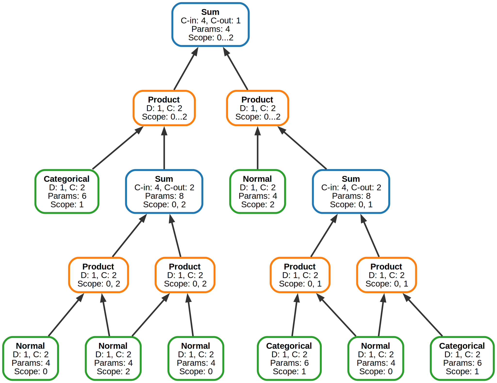

# SPFlow: An Easy and Extensible Library for Probabilistic Circuits

[](https://www.python.org/downloads/)
[](https://github.com/SPFlow/SPFlow/blob/master/LICENSE)
[](https://black.readthedocs.io/en/stable/)
[](https://codecov.io/gh/SPFlow/SPFlow)
[](https://semver.org/)

**SPFlow** is a flexible, modular library for building and reasoning with **Sum-Product Networks (SPNs)** and **Probabilistic Circuits (PCs)**. These are deep generative and discriminative models that enable tractable (polynomial-time) probabilistic inference while maintaining expressive power. SPFlow is built on [PyTorch](https://pytorch.org/), providing GPU acceleration and seamless integration with modern deep learning workflows.

**Key Features:**
- Exact probabilistic inference: marginals, conditionals, most probable explanations
- Modular model construction: manual design or automatic structure learning
- Learning algorithms: gradient descent, expectation-maximization, structure learning
- Full support for missing data and various distribution types
- GPU acceleration via PyTorch

## Installation

Install from PyPI:

```bash
pip install spflow
```

For contributor/development setup (from source), see [CONTRIBUTING.md](CONTRIBUTING.md).

## Quick Start

This example builds a more complex circuit, runs likelihood evaluation and sampling, and (optionally) visualizes it.

```python
import shutil

import torch
from spflow.meta import Scope
from spflow.modules.leaves import Categorical, Normal
from spflow.modules.products import Product
from spflow.modules.sums import Sum
from spflow.utils.visualization import visualize

torch.manual_seed(0)

# Feature indices (X, Z1, Z2)
x_idx, z1_idx, z2_idx = 0, 1, 2

# ---- Leaf modules ----
# Left branch will model Z1 together with a mixture over (X, Z2)
leaf_z1_left = Categorical(scope=Scope([z1_idx]), out_channels=2, K=3)
leaf_x_1 = Normal(scope=Scope([x_idx]), out_channels=2)
leaf_z2_1 = Normal(scope=Scope([z2_idx]), out_channels=2)
leaf_x_2 = Normal(scope=Scope([x_idx]), out_channels=2)

# Right branch will model Z2 together with a mixture over (Z1, X)
leaf_z2_right = Normal(scope=Scope([z2_idx]), out_channels=2)
leaf_z1_1 = Categorical(scope=Scope([z1_idx]), out_channels=2, K=3)
leaf_x_3 = Normal(scope=Scope([x_idx]), out_channels=2)
leaf_z1_2 = Categorical(scope=Scope([z1_idx]), out_channels=2, K=3)

# ---- Left branch: Z1 × Sum(X × Z2) ----
# Products combine disjoint scopes (decomposability)
prod_x_z2 = Product(inputs=[leaf_x_1, leaf_z2_1])
prod_z2_x = Product(inputs=[leaf_z2_1, leaf_x_2])

# Sum mixes alternatives with identical scope
sum_x_z2 = Sum(inputs=[prod_x_z2, prod_z2_x], out_channels=2)
prod_z1_sum_xz2 = Product(inputs=[leaf_z1_left, sum_x_z2])

# ---- Right branch: Z2 × Sum(Z1 × X) ----
prod_z1_x_1 = Product(inputs=[leaf_z1_1, leaf_x_3])
prod_z1_x_2 = Product(inputs=[leaf_z1_2, leaf_x_3])
sum_z1_x = Sum(inputs=[prod_z1_x_1, prod_z1_x_2], out_channels=2)
prod_z2_sum_z1x = Product(inputs=[leaf_z2_right, sum_z1_x])

# ---- Root: mixture over the two branches ----
root = Sum(inputs=[prod_z1_sum_xz2, prod_z2_sum_z1x], out_channels=1)

# Likelihood evaluation expects data shaped (N, D)
# Build each feature separately so categorical dimensions get valid integer values.
num_rows = 32
data_x = torch.randn(num_rows)
data_z1 = torch.randint(low=0, high=3, size=(num_rows,), dtype=torch.int64).to(torch.float32)
data_z2 = torch.randn(num_rows)
data = torch.stack([data_x, data_z1, data_z2], dim=1)
ll = root.log_likelihood(data)

# Unconditional sampling
samples = root.sample(num_samples=5)

print(f"root.out_shape={root.out_shape}")
print(f"data.shape={data.shape}")
print(f"ll.shape={ll.shape}")
print(f"samples.shape={samples.shape}")

# Optional visualization (requires Graphviz `dot`)
if shutil.which("dot") is not None:
    visualize(root, output_path="/tmp/spflow-structure", show_scope=True, show_shape=True, format="svg")
```


## Example DSL (for demos)

SPFlow also includes a tiny, example-oriented DSL for constructing small circuits in a readable algebraic form.
It is intentionally non-invasive (it does not modify core modules) and returns a real `Module` via `.build()`.

```python
import torch

from spflow.modules.leaves import Normal
from spflow.dsl import dsl

with dsl():
    terms = 0.4 * Normal(0) * Normal(1) + 0.6 * Normal(0) * Normal(1)

pc = terms.build()
ll = pc.log_likelihood(torch.randn(8, 2))
print(ll.shape)
```

More examples can be found in the [User Guide](https://spflow.github.io/guides/user_guide.html).

## Documentation

- **[User Guide](docs/source/guides/user_guide.ipynb)**: Comprehensive notebook with examples covering model
  construction, training, inference, and advanced use cases
- **[Contributing Guide](CONTRIBUTING.md)**: Guidelines for contributing to SPFlow
- **[Versioning Guide](VERSIONING.md)**: Semantic versioning and commit conventions
- **[Release Guide](RELEASE.md)**: Release process documentation

## Development Status

SPFlow 1.0.0 represents a complete rewrite of SPFlow with PyTorch as the primary backend. This version features:

- Modern PyTorch architecture for GPU acceleration
- Significantly improved performance
- Enhanced modular design

See the [CHANGELOG](CHANGELOG.md) for detailed version history and recent changes.

## Contributing

We welcome contributions! Please see [CONTRIBUTING.md](CONTRIBUTING.md) for contribution guidelines.

## Citation
If you find SPFlow useful please cite us in your work:
```
@misc{Molina2019SPFlow,
  Author = {Alejandro Molina and Antonio Vergari and Karl Stelzner and Robert Peharz and Pranav Subramani and Nicola Di Mauro and Pascal Poupart and Kristian Kersting},
  Title = {SPFlow: An Easy and Extensible Library for Deep Probabilistic Learning using Sum-Product Networks},
  Year = {2019},
  Eprint = {arXiv:1901.03704},
}
```

## Authors & Contributors

### Lead Authors

* **[Steven Braun](https://steven-braun.com)** - *TU Darmstadt*
* **[Arseny Skryagin](https://www.aiml.informatik.tu-darmstadt.de/people/skryagin/)** - *TU Darmstadt*
* **[Alejandro Molina](https://scholar.google.de/citations?user=VIHj44oAAAAJ&hl=en)** - *TU Darmstadt*
* **[Antonio Vergari](http://nolovedeeplearning.com)** - *University of Edinburgh*
* **[Karl Stelzner](https://www.aiml.informatik.tu-darmstadt.de/people/kstelzner/)** - *TU Darmstadt*
* **[Robert Peharz](https://robert-peharz.github.io)** - *TU Graz*
* **[Nicola Di Mauro](http://www.di.uniba.it/~ndm/)** - *University of Bari Aldo Moro*
* **[Kristian Kersting](https://www.aiml.informatik.tu-darmstadt.de/people/kkersting/index.html)** - *TU Darmstadt*

### Contributors

* **Philipp Deibert** - *TU Darmstadt*
* **Kevin Huy Nguyen** - *TU Darmstadt*
* **[Bennet Wittelsbach](https://twitter.com/bennet_wi)** - *TU Darmstadt*
* **[Felix Divo](https://felix.divo.link)** - *TU Darmstadt*
* **Moritz Kulessa** - *TU Darmstadt*
* **[Claas Voelcker](https://cvoelcker.de)** - *TU Darmstadt*
* **Simon Roesler** - *Karlsruhe Institute of Technology*
* **[Alexander L. Hayes](https://hayesall.com)** - *Indiana University, Bloomington*
* **[Alexander Zeikowsky](https://github.com/AlexTUD19)** - *TU Darmstadt*

See the full list of [contributors](https://github.com/SPFlow/SPFlow/contributors) on GitHub.

## License

This project is licensed under the Apache License, Version 2.0 - see the [LICENSE](LICENSE) file for details.


## Acknowledgments

* Parts of SPFlow as well as its motivating research have been supported by the Germany Science Foundation (DFG) - AIPHES, GRK 1994, and CAML, KE 1686/3-1 as part of SPP 1999- and the Federal Ministry of Education and Research (BMBF) - InDaS, 01IS17063B.

* This project received funding from the European Union's Horizon 2020 research and innovation programme under the Marie Sklodowska-Curie Grant Agreement No. 797223 (HYBSPN).
